## Evaluation Criteria (100 points for covering all criteria)

1. **Grafana Installation (30 points)**
   - Grafana is installed on the K8s cluster using the Helm chart by Bitnami.

    - https://github.com/CiscoSA/rs-grafana/blob/task_8/.github/workflows/deploy.yml#L26-L34

    - https://github.com/CiscoSA/rs-grafana/actions/runs/12224683341/job/34097734067#step:5:10

    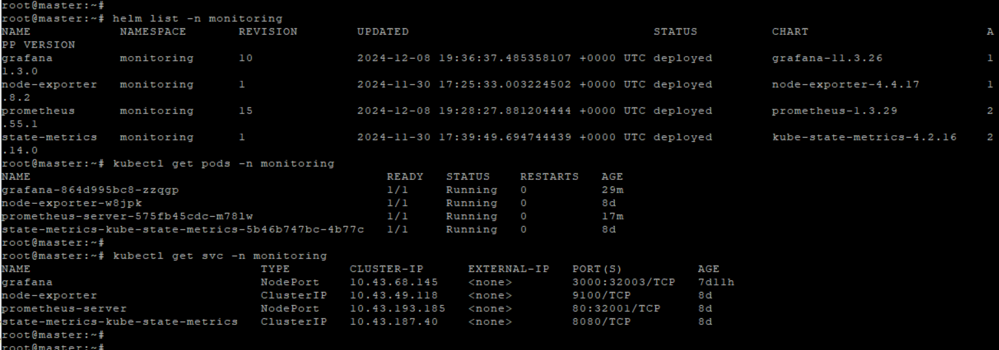

   - A data source pointing to the existing Prometheus installation is added.

    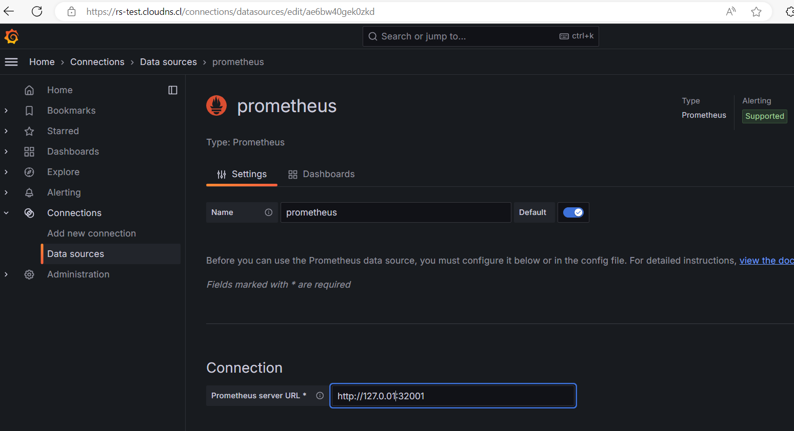
    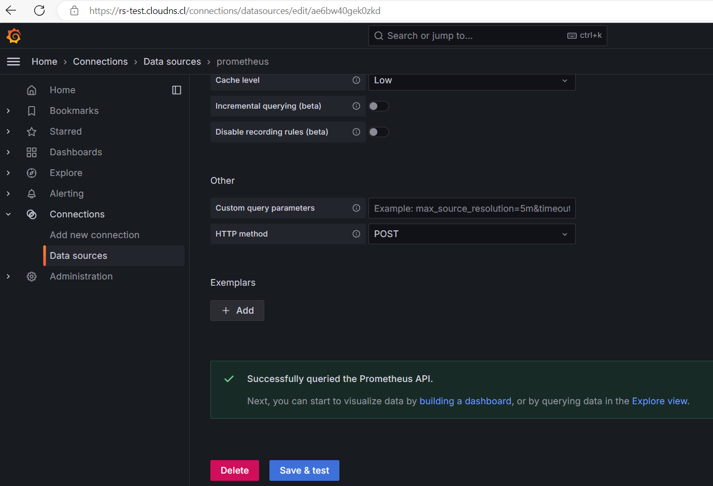
    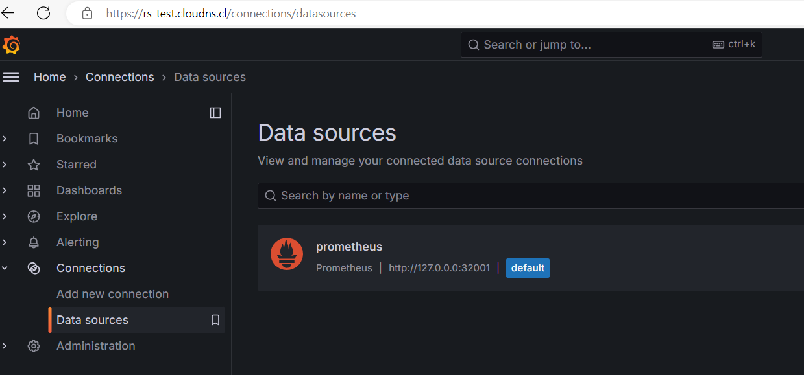

2. **Dashboard Creation (40 points)**
   - A dashboard is created with basic metrics visualized, such as CPU and memory utilization, storage usage, etc.

    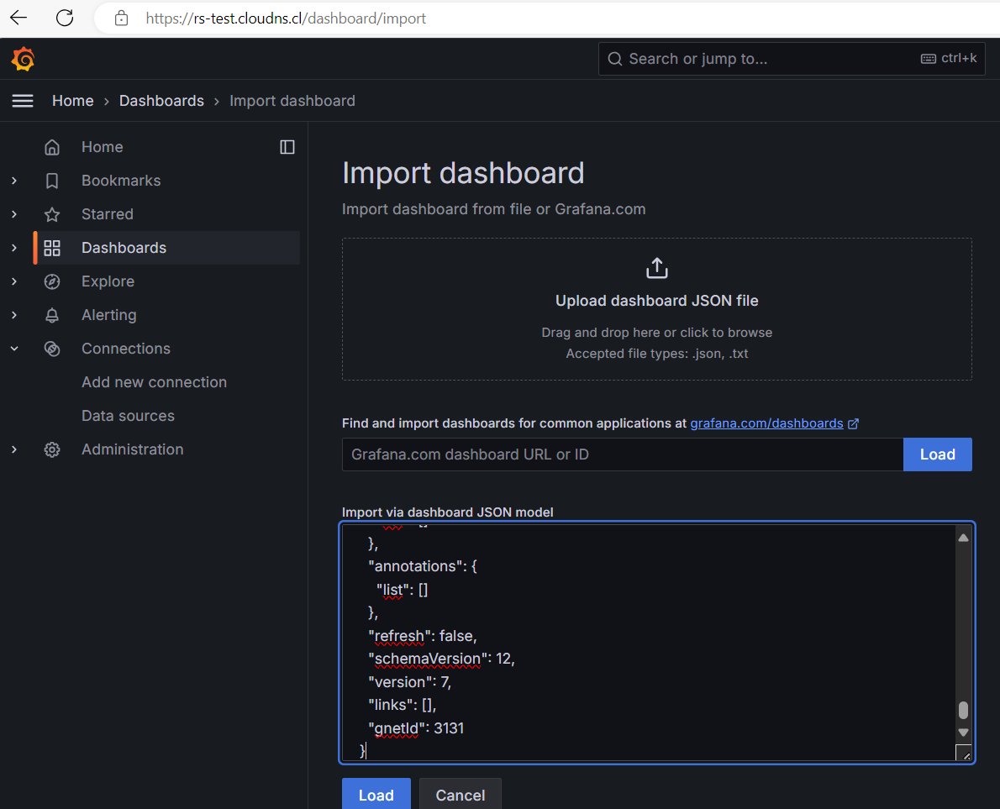
    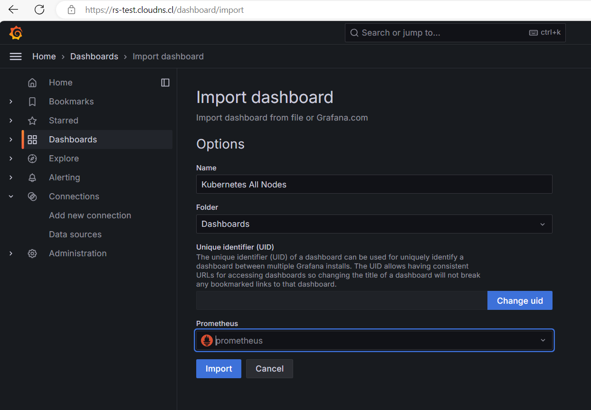
    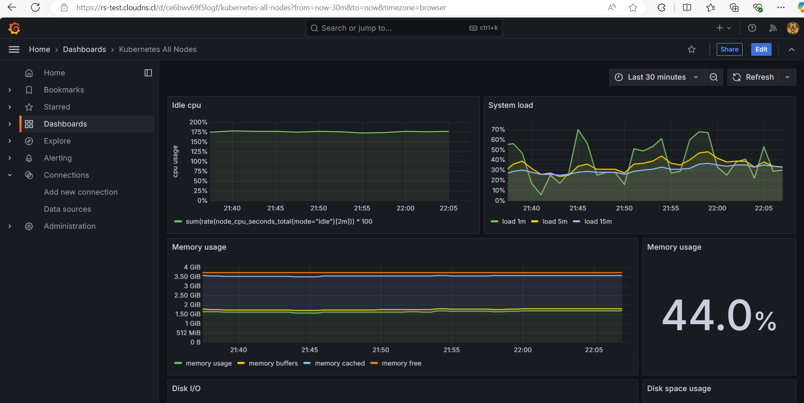
    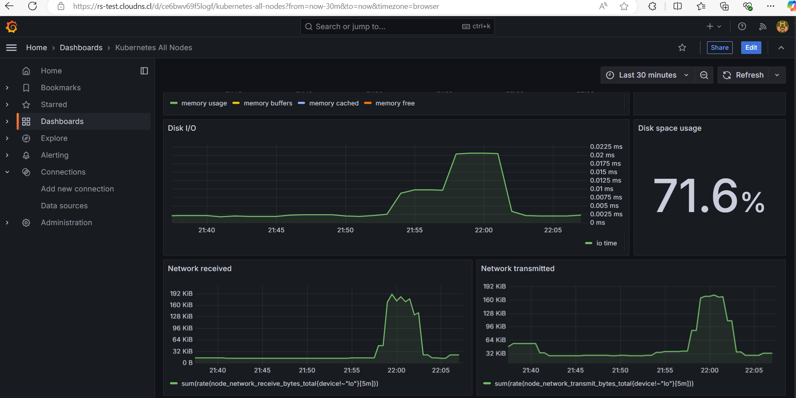

3. **Deployment Automation (10 points)**
   - Automation of deployment with IaC or CI/CD pipeline is created.

     - https://github.com/CiscoSA/rs-grafana/blob/task_8/.github/workflows/deploy.yml#L26-L34

     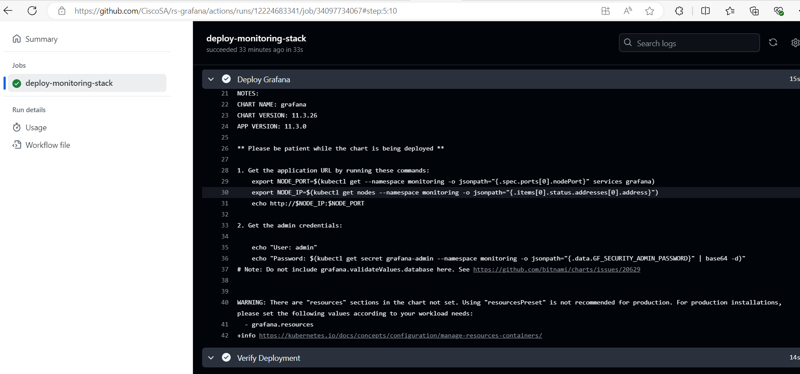     

4. **Additional Tasks (20 points)**
   - Admin user password is created with a separate secret. (10 points)
     
     - https://github.com/CiscoSA/rs-grafana/blob/task_8/.github/workflows/deploy.yml#L32

     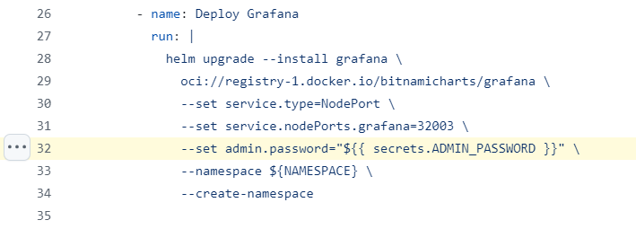

     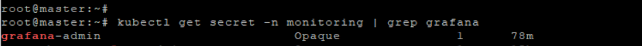

     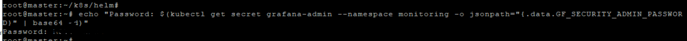

   - A JSON file of the dashboard layout is provided. (5 points)

     - https://github.com/CiscoSA/rs-grafana/blob/task_8/dashboard/nodes.json

   - The Grafana setup, including the dashboard creation, is documented in a README file. (5 points)

     - https://github.com/CiscoSA/rs-grafana/blob/task_8/README.md